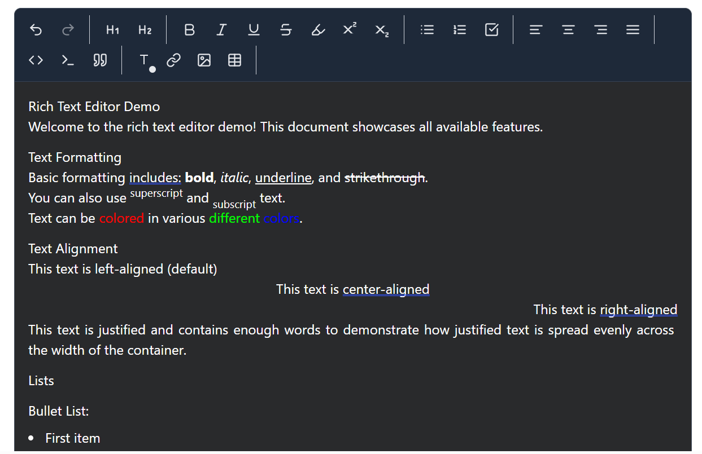

# React TipTap Rich Text Editor

A highly customizable rich text editor for React applications built on top of TipTap. Features a modern UI, dark mode support, and extensive formatting options.

[](https://www.npmjs.com/package/rich-editor)
[](https://github.com/yourusername/your-repo/blob/main/LICENSE)

## Table of Contents

- [React TipTap Rich Text Editor](#react-tiptap-rich-text-editor)
  - [Table of Contents](#table-of-contents)
  - [Overview](#overview)
  - [Features](#features)
  - [Demo](#demo)
  - [Installation](#installation)
- [Using yarn](#using-yarn)
- [Using pnpm](#using-pnpm)
  - [Usage](#usage)
  - [Props](#props)
  - [Examples](#examples)
    - [Basic Text Formatting](#basic-text-formatting)
    - [As a Form Field](#as-a-form-field)
  - [Styling](#styling)
  - [Contributing](#contributing)
    - [Writing Tests](#writing-tests)
    - [Development Setup](#development-setup)
  - [License](#license)
  - [Acknowledgements](#acknowledgements)
  - [Support](#support)

## Overview

This rich text editor provides a powerful, extensible editing experience with a clean, modern interface. Built using TipTap and React, it offers a wide range of formatting options and features while maintaining excellent performance and reliability.

## Features

- 📝 Rich Text Formatting
  - Bold, Italic, Underline, Strikethrough
  - Superscript and Subscript
  - Text Color with Color Picker
  - Text Alignment
  - Headings (H1, H2)
  - Lists (Ordered, Unordered, Task Lists)
  - Code Blocks with Syntax Highlighting
  - Blockquotes
  - Tables with Column Resizing
  
- 🎨 Advanced Features
  - Image Upload and Resizing
  - Link Management
  - Table Management
  - Code Block with Language Selection
  
- 🌓 Theme Support
  - Light/Dark Mode
  - System Theme Detection
  - Customizable Styles
  
- 💪 Technical Features
  - TypeScript Support
  - Responsive Design
  - Accessible
  - Customizable via Props
  - Extensible Architecture

## Demo



## Installation

This package requires React 18 and Tailwind CSS as peer dependencies.

# Using yarn
`yarn add rich-editor`

# Using pnpm
`pnpm add rich-editor`


## Usage

Basic usage:

Don't forget to import the styles:

```tsx
import { RichEditor } from '@nishant_verma/rich-editor';
import '@nishant_verma/rich-editor/dist/styles.css';

function App() {
  return (
    <RichEditor
      content="Hello, world!"
      onUpdate={({ editor }) => {
        const html = editor.getHTML();
        console.log(html);
      }}
    />
  );
}
```

With all options:

```tsx
import { RichEditor } from '@nishant_verma/rich-editor';
import '@nishant_verma/rich-editor/dist/styles.css';

function App() {
  return (
    <RichEditor
      content="Initial content"
      placeholder="Start writing..."
      editable={true}
      autofocus={true}      
      className="custom-editor"
      showToolbar={true}
      onUpdate={({ editor }) => {
        // Handle content updates
      }}
      onBlur={({ editor }) => {
        // Handle blur events
      }}
      onFocus={({ editor }) => {
        // Handle focus events
      }}
    />
  );
}
```

## Props

| Prop | Type | Default | Description |
|------|------|---------|-------------|
| content | string | '' | Initial content of the editor |
| placeholder | string | 'Start writing...' | Placeholder text when editor is empty |
| editable | boolean | true | Whether the editor is editable |
| autofocus | boolean | false | Whether to focus the editor on mount |
| className | string | '' | Additional CSS classes |
| showToolbar | boolean | true | Whether to show the toolbar |
| onUpdate | function | undefined | Callback when content changes |
| onBlur | function | undefined | Callback when editor loses focus |
| onFocus | function | undefined | Callback when editor gains focus |

## Examples

### Basic Text Formatting

```tsx
<RichEditor
  content="<p>Hello <strong>world</strong>!</p>"
  onUpdate={({ editor }) => {
    console.log(editor.getHTML());
  }}
/>
```


### As a Form Field

```tsx
function Form() {
  const [content, setContent] = useState('');

  return (
    <form onSubmit={handleSubmit}>
      <RichEditor
        content={content}
        onUpdate={({ editor }) => {
          setContent(editor.getHTML());
        }}
      />
      <button type="submit">Submit</button>
    </form>
  );
}
```

## Styling

The editor uses Tailwind CSS for styling. You can customize the appearance by:

1. Overriding the default classes
2. Using the `className` prop
3. Modifying the CSS variables

```css
.rich-editor {
  --editor-bg: #ffffff;
  --editor-text: #000000;
  /* ... other variables */
}
```

## Contributing

We welcome contributions! Please follow these steps:

1. Fork the repository
2. Create a new branch: `git checkout -b feature/your-feature`
3. Make your changes
4. Run tests: `npm test`
5. Commit your changes: `git commit -m 'Add some feature'`
6. Push to the branch: `git push origin feature/your-feature`
7. Submit a pull request

### Writing Tests
The project uses Vitest and React Testing Library for testing. To run tests:

When contributing, please ensure your changes include appropriate tests. See the `src/__tests__` directory for examples.


```bash
npm test
```

To run tests in watch mode:

```bash
npm test:watch
```

To run tests with coverage:

```bash
npm test:coverage
```


### Development Setup

```bash
# Clone the repository
git clone https://github.com/nishant9083/rich-editor.git

# Install dependencies
npm install

# Start development server
npm run dev

# Run tests
npm test

# Build for production
npm run build
```

## License

This project is licensed under the MIT License - see the [LICENSE](LICENSE) file for details.

## Acknowledgements

- [TipTap](https://tiptap.dev/) - The headless editor framework
- [React](https://reactjs.org/) - The UI library
- [Tailwind CSS](https://tailwindcss.com/) - For styling
- [Lucide Icons](https://lucide.dev/) - For the editor icons
- All the contributors who have helped improve this project

## Support

- Report bugs on our [issue tracker](https://github.com/nishant9083/rich-editor/issues)
<!-- - Join our [Discord community](https://discord.gg/your-invite)
- Follow our [Twitter](https://twitter.com/your-handle) for updates -->

---

Built with ❤️ by [Nishant Verma](https://github.com/nishant9083)


